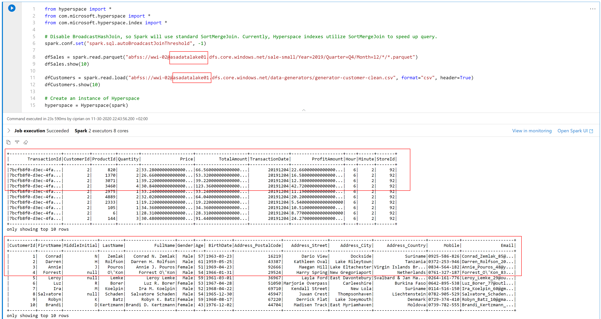

# Index the Data Lake storage with Hyperspace

When loading data from Azure Data Lake Gen 2, searching in the data in one of the most resource consuming operations. [Hyperspace](https://github.com/microsoft/hyperspace) introduces the ability for Apache Spark users to create indexes on their datasets, such as CSV, JSON, and Parquet, and use them for potential query and workload acceleration.

Hyperspace lets you create indexes on records scanned from persisted data files. After they're successfully created, an entry that corresponds to the index is added to the Hyperspace's metadata. This metadata is later used by Apache Spark's optimizer during query processing to find and use proper indexes. If the underlying data changes, you can refresh an existing index to capture that.

Also, Hyperspace allows users to compare their original plan versus the updated index-dependent plan before running their query.

Add a new cell to your notebook with the following code (remember to replace `<unique_suffix>` with the value you specified during the Synapse Analytics workspace deployment):

```python
from hyperspace import *  
from com.microsoft.hyperspace import *
from com.microsoft.hyperspace.index import *

# Disable BroadcastHashJoin, so Spark will use standard SortMergeJoin. Currently, Hyperspace indexes utilize SortMergeJoin to speed up query.
spark.conf.set("spark.sql.autoBroadcastJoinThreshold", -1)

dfSales = spark.read.parquet("abfss://wwi-02@asagadatalake<unique_suffix>.dfs.core.windows.net/sale-small/Year=2019/Quarter=Q4/Month=12/*/*.parquet")
dfSales.show(10)

dfCustomers = spark.read.load("abfss://wwi-02@asagadatalake<unique_suffix>.dfs.core.windows.net/data-generators/generator-customer-clean.csv", format="csv", header=True)
dfCustomers.show(10)

# Create an instance of Hyperspace
hyperspace = Hyperspace(spark)
```

Run the new cell. It will load the two DataFrames with data from the data lake and initalize Hyperspace.



Add another new cell to your notebook with the following code:

```python
#create indexes: each one contains a name, a set of indexed columns and a set of included columns
indexConfigSales = IndexConfig("indexSALES", ["CustomerId"], ["TotalAmount"])
indexConfigCustomers = IndexConfig("indexCUSTOMERS", ["CustomerId"], ["FullName"])

hyperspace.createIndex(dfSales, indexConfigSales)			# only create index once
hyperspace.createIndex(dfCustomers, indexConfigCustomers)	# only create index once
hyperspace.indexes().show()
```

Run the new cell. It will create two indexes and display their structure.


Add another new cell to your notebook with the following code:

```python
df1 = dfSales.filter("""CustomerId = 203""").select("""TotalAmount""")
df1.show()
df1.explain(True)
```

Run the new cell. The output will show that the physical execution plan is not taking into account any of the indexes (performs a file scan on the original data file).


Now add another new cell to your notebook with the following code (notice the extra line at the beginning used to enable Hyperspace optimization in the Spark engine):

```python
# Enable Hyperspace - Hyperspace optimization rules become visible to the Spark optimizer and exploit existing Hyperspace indexes to optimize user queries
Hyperspace.enable(spark)
df1 = dfSales.filter("""CustomerId = 203""").select("""TotalAmount""")
df1.show()
df1.explain(True)
```

Run the new cell. The output will show that the physical execution plan is now using the index instead of the orginal data file.


Hyperspace provides an Explain API that allows you to compare the execution plans without indexes vs. with indexes. Add a new cell with the following code:

```python
df1 = dfSales.filter("""CustomerId = 203""").select("""TotalAmount""")

spark.conf.set("spark.hyperspace.explain.displayMode", "html")
hyperspace.explain(df1, True, displayHTML)
```

Run the new cell. The output shows a comparison `Plan with indexes` vs. `Plan without indexes`. Observe how, in the first case the index file is used while in the second case the original data file is used.


Let's investigate now a more complex case, involving a join operation. Add a new cell with the following code:

```python
eqJoin = dfSales.join(dfCustomers, dfSales.CustomerId == dfCustomers.CustomerId).select(dfSales.TotalAmount, dfCustomers.FullName)

hyperspace.explain(eqJoin, True, displayHTML)
```

Run the new cell. The output shows again a comparison `Plan with indexes` vs. `Plan without indexes`, where indexes are used in the first case and the original data files in the second.


In case you want to deactivate Hyperspace and cleanup the indexes, you can run the following code:

```python
# Disable Hyperspace - Hyperspace rules no longer apply during query optimization. Disabling Hyperspace has no impact on created indexes because they remain intact
Hyperspace.disable(spark)

hyperspace.deleteIndex("indexSALES")
hyperspace.vacuumIndex("indexSALES")
hyperspace.deleteIndex("indexCUSTOMERS")
hyperspace.vacuumIndex("indexCUSTOMERS")
```